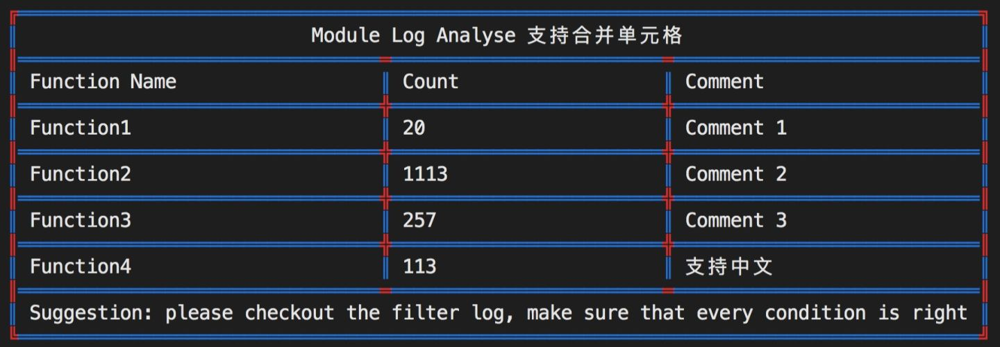

# shell脚本

## 特性

1. 支持 centos、mac 和 ubuntu 等多种平台

## draw_table.sh

#### 1. 功能

在终端可视化输出表格数据（列用`\t`分隔，行用`\n`分隔）



#### 2. 使用方法

> https://zhuanlan.zhihu.com/p/144802861

```bash
# 管道方法
 $ echo -e "A\tB\na\tb" | sh draw_table.sh
+---+---+
|,A,|,B,|
+---+---+
|,a,|,b,|
+---+---+

# 文件方法
$ echo -e "Your Topic\nA\tB\tC\td\na\tb\th\ts\td\n5\n78\t34" > list.txt
# 第一个参数控制表格形式
$ sh draw_table.sh  < list.txt
+---------------------+
|,,,,,Your Topic,,,, ,|
+----+----+---+---+---+
|,A,,|,B,,|,C,|,d,|,,,|
+----+----+---+---+---+
|,a,,|,b,,|,h,|,s,|,d,|
+----+----+---+---+---+
|,,,,,,,,,,5,,,,,,,,,,|
+----+----+---+---+---+
|,78,|,34,|,,,|,,,|,,,|
+----+----+---+---+---+

# 自定义模式
# 自定义表格边框：需要用"%"开头，前9位表示表格边框，第10位没有用处，第11-13 表示行的上、中、下分隔符，第14-16表示列的左、中、右分隔符
# 自定义颜色：第一个参数表示表格框架的颜色，第二个参数表示表格内容的颜色，第三个参数表示其他颜色
# 最后可以传入16个颜色参数，表示style中每个字符的颜色

$ sh draw_table.sh '%123456789 abcABC' -red,-blue,-green  < list.txt
7aaaaaaaaaaaaaaaaaaaaa9
A     Your Topic      C
4bbbb8bbbb8bbb8bbb8bbb6
A A  B B  B C B d B   C
4bbbb5bbbb5bbb5bbb5bbb6
A a  B b  B h B s B d C
4bbbb2bbbb2bbb2bbb2bbb6
A          5          C
4bbbb8bbbb8bbb8bbb8bbb6
A 78 B 34 B   B   B   C
1cccc2cccc2ccc2ccc2ccc3
```
